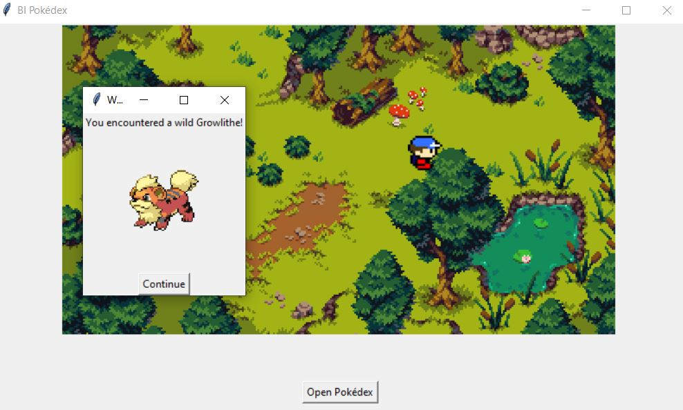
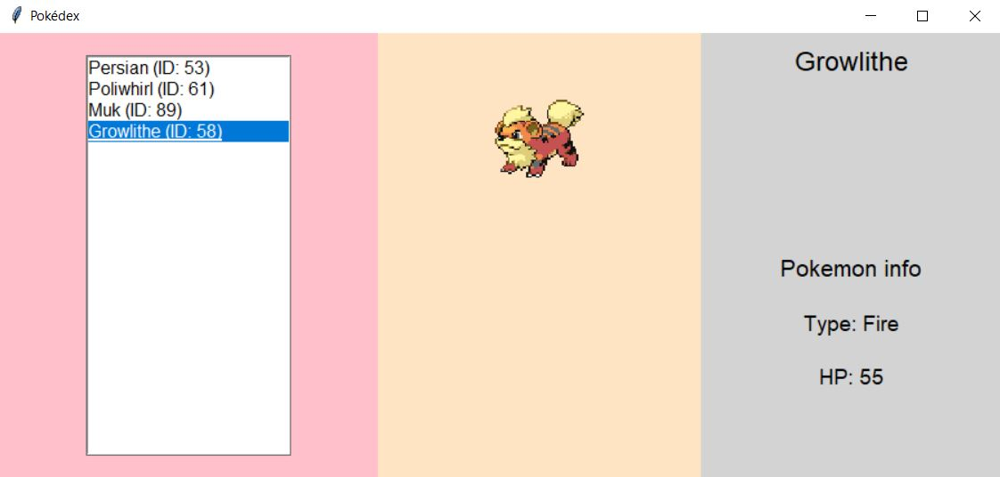
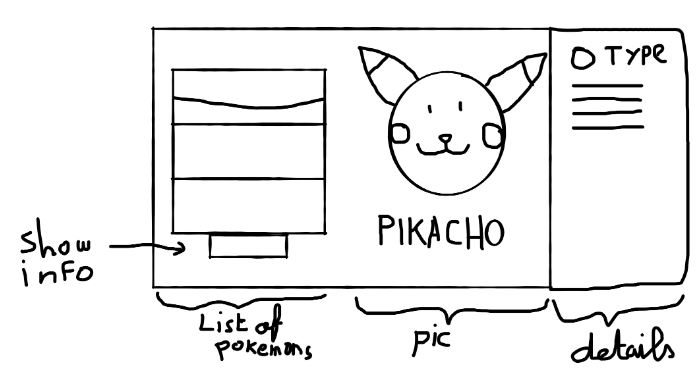

# BI Pokedex!

## Add Your Group Name Here:

**[Group Name]**

## Add Your Names Here:

1. [Student Name 1]
2. [Student Name 2]
3. [Student Name 3]
4. [Student Name 4]
5. [Student Name 5]

---

## Instructions

- Clone this repo
- Fix the movements of the player (main.py)
- Complete the starter code to add a pokedex to the game. Use the screenshots and the original design of the pokedex we did in class for inspiration:
  
  
  
- Push your completed work to GitHub before December 31
- Each student must submit at least 2 commits to the repository as part of the submission
